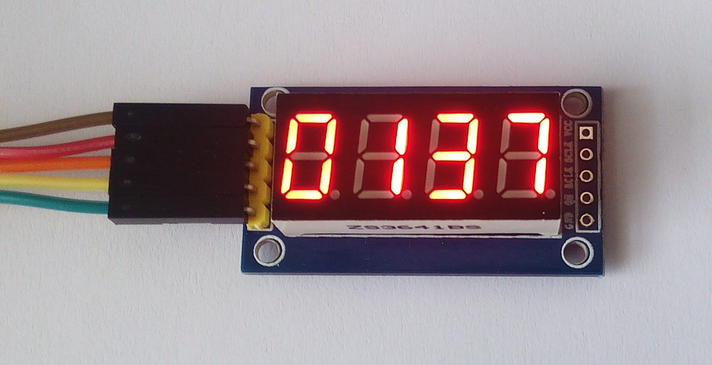

Arduino library for 4-Bits Digital Tube LED Display
===================================================



**Still under constrition. Please be patience...**


Description
-----------
An Arduino library for 7-segment display modules based on the 74HC595 chips,
such as...

**You can test it, all examples are functional :-)**

Version History
---------------
```
20150430 v0.8.5
* upload to GitHub

20150429 v0.8.3
* added function writeDisp(uint8_t *digs)
* added example countner

20150428 v0.8.2
* first functional class Tube7seg
* examples: first, pi, analog
* no documentation :-(
```
